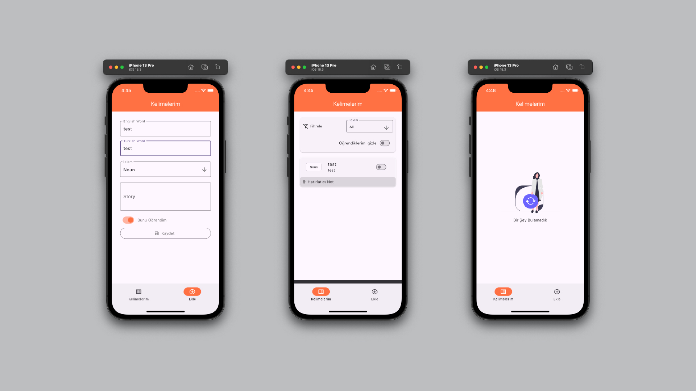

### Vocabulary App - Flutter Vocabulary Learning App

<p align="center">
	
</p>

## 🛠️ Technologies Used

- **Flutter** (v3.19.5)
- **Dart** (v3.3.0)
- **Isar Database** (v4.0.0)
- **Flutter SVG** (For vector graphics)

### Installation
1. Clone the repository:
```sh
git clone https://github.com/mertcan-tas/vocabulary-app-flutter.git
```

2. Install dependencies:
```sh
flutter pub get
```

3. Run build_runner for code generation:
```sh
flutter pub run build_runner build
```

3. Run the app:
```sh
flutter run
```


